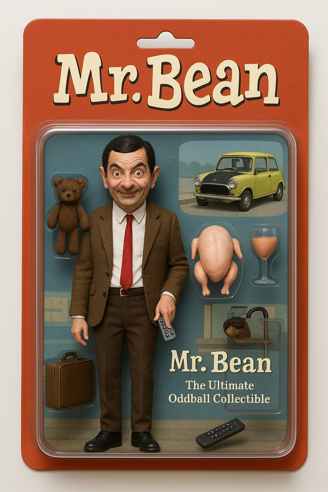

### Create 3D Toy Set
Using text prompt to create a 3D toy set

**Tool/Model used:** `ChatGPT 4o` 

**Prompt:**
```
Create a realistic and humorous action figure of Mr. Bean, the iconic British comedy character played by Rowan Atkinson. 

The figure should be designed as a collectible action toy, capturing his quirky personality and classic look.  
Key Elements:  

Character Design:  Accurately depict Mr. Bean’s exaggerated facial expression, distinctive features, and comedic body posture.  

Outfit: Signature brown tweed jacket, white shirt, thin red tie, dark trousers, and black shoes.  Include a slightly awkward or goofy pose that reflects his clumsy yet lovable charm.  Accessories:  Include miniature props that are instantly recognizable from the show, such as:  Teddy (his beloved stuffed bear)  A suitcase  His iconic lime green Mini car (as a miniature or on the box design)  A turkey (as a reference to the famous holiday episode)  A TV remote or random quirky objects that fit his antics  

Packaging Design:  Place the action figure inside a detailed, collectible toy box.  At the top of the box, display the title Mr. Bean in playful, bold lettering.  Beneath that, include the character name "Mr. Bean", possibly with a humorous tagline like “The Ultimate Oddball Collectible.”  The background design can feature a silly scene from the show (like his apartment or the car park).  

Visual Style:  Render the entire figure, accessories, and packaging in a highly realistic, slightly cartoonish style to capture the essence of the character while keeping a lifelike toy aesthetic.
```



---
