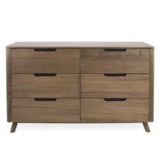

# 🧠 Image Generation Playground

Welcome to the ultimate collection of creative use cases for LLM image generation capabilities.
This open-source project showcases how you can transform/generate images using tools like `ChatGPT 4o` and `Google Gemini`.
The goal is to colelct all the examples and showcase them in one place to inspire people demonstrate their creativity with AI tools.

Whether you're a developer, artist, or AI enthusiast, this repository is your inspiration hub and contribution platform for exploring the power of multimodal AI.


# ✨ What You’ll Find Here

- Prompt-to-Image Examples with visual results

- Categories like image processing, style transfer, cartoon generation and so on

- Ready-to-copy prompts and real user showcases

- A simple way to contribute your own creations

**🔍 Want to try it yourself? Explore all the usage below or [contribute your own](CONTRIBUTION.md) and join the community of AI image explorers.**


# 🖼️ Image Processing

### **Colorize Photos**
Turn a black and white photo in to color photo

**Tool/Model used:** `ChatGPT 4o` 

**Prompt:**
```
Create image Restore this black and white photo and colorize it
```
 

---

### **Remove People**
Remove People from the scene

**Tool/Model used:** `ChatGPT 4o` 

**Prompt:**
```
Create image Modify the picture, request to remove all people in the picture, and keep 100% of all street scenes and store scenes
```
 


### [🔍 See More Image Processing Examples...](image-processing/showcase.md)
<br>


# 🎨 Style Transfer

### Chibi Style
Turn image into chibi style

**Tool/Model used:** `ChatGPT 4o` 

**Prompt:**
```
Create image Turn this image into Chibi style
```
 

---

### Ghibili Style
Turn image into Ghibili style

**Tool/Model used:** `ChatGPT 4o` 

**Prompt:**
```
Create image Turn this image into studio Ghibli style
```

 

---

### [🔍 See More Style Transfer Examples...](style-transfer/showcase.md)
<br>


# 💡 Logo Design

### 2D -> 3D
Turn a 2D logo into a 3D logo

**Tool/Model used:** `ChatGPT 4o` 

**Prompt:**
```
Create image Make the 3D version of the attached Icon
```

 

---

### Neon Effect
Add a neon effect to the logo

**Tool/Model used:** `ChatGPT 4o` 

**Prompt:**
```
Create image Turn this logo into a realistic neon sign illustration. Use vibrant glowing neon colors (cyan, magenta, electric blue, or bright green) with a dark background to emphasize luminosity. Add soft ambient lighting, subtle glow effects, reflections, and a slight hint of shadows for realism. Make sure the neon tubes follow the shape and lines of the logo clearly, maintaining its original proportions and structure.
```
 

---

### [🔍 See More Logo Design Examples...](logo-design/showcase.md)
<br>


# 🛖 Interior Design

### Change Wall Color
Preview the room with a different wall color

**Tool/Model used:** `ChatGPT 4o` 

**Prompt:**
```
Create image Change the wall color of the room in the first attached image to the color of the second attached image, keeping all furniture, decorations, lighting, and layout exactly the same. Preserve shadows, textures, and natural lighting to maintain a realistic appearance.
```

 


---

### Preivew Furniture Layout
Preview the furniture layout in the room

**Tool/Model used:** `ChatGPT 4o` 

**Prompt:**
```
Create image  Realistically add the furniture from the second image into the room from the first image. Position it naturally behind the bed within the existing layout, matching the scale, perspective, lighting, and shadows of the original room. Preserve the original style and colors of the room while seamlessly integrating the new furniture, creating a cohesive and believable preview.
```
  

 

--- 

### [🔍 See More Interior Design Examples...](interior-design/showcase.md)
<br>


