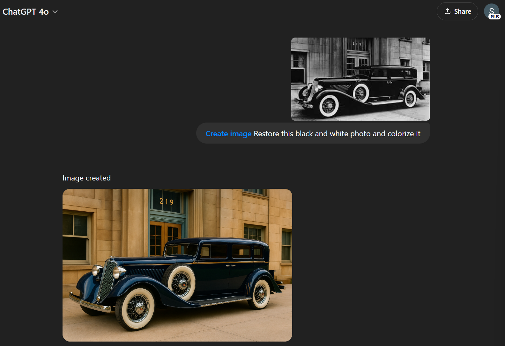
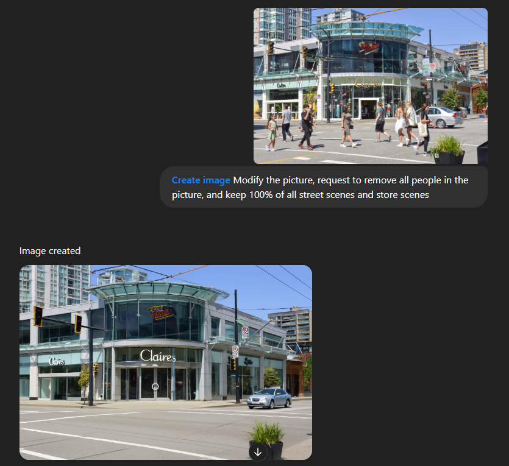

# 🧠 Image Generation Playground

Welcome to the ultimate collection of creative use cases for LLM image generation capabilities.
This open-source project showcases how you can transform/generate images using tools like `ChatGPT 4o` and `Google Gemini`.
The goal is to colelct all the examples and showcase them in one place to inspire people demonstrate their creativity with AI tools.

Whether you're a developer, artist, or AI enthusiast, this repository is your inspiration hub and contribution platform for exploring the power of multimodal AI.


# ✨ What You’ll Find Here

- Prompt-to-Image Examples with visual results

- Categories like image processing, style transfer, cartoon generation and so on

- Ready-to-copy prompts and real user showcases

- A simple way to contribute your own creations

**🔍 Want to try it yourself? Explore all the usage below or [contribute your own](CONTRIBUTION.md) and join the community of AI image explorers.**


# 🖼️ Image Processing

### **Colorize Photos**
Turn a black and white photo in to color photo

**Tool/Model used:** `ChatGPT 4o` 

**Prompt:**
```
Create image Restore this black and white photo and colorize it
```


---

### **Remove People**
Remove People from the scene

**Tool/Model used:** `ChatGPT 4o` 

**Prompt:**
```
Create image Modify the picture, request to remove all people in the picture, and keep 100% of all street scenes and store scenes
```



### [🔍 See More Image Processing Examples...](image-processing/showcase.md)
<br>


# 🎨 Style Transfer

