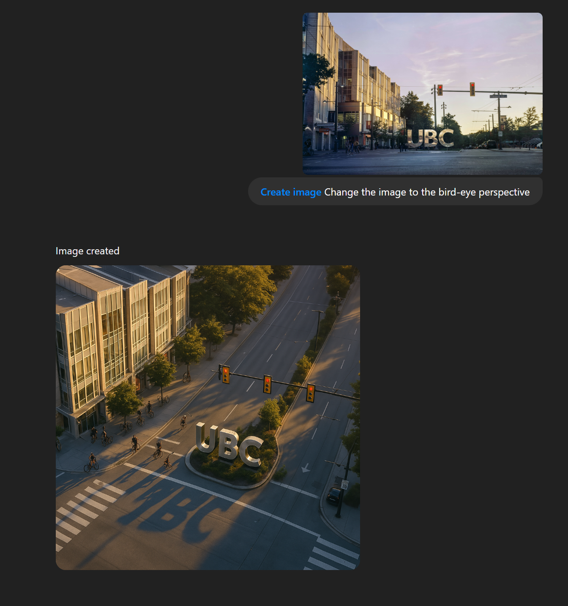

## Colorize Photos
Turn a black and white photo in to color photo

**Tool/Model used:** `ChatGPT 4o` 

**Prompt:**
```
Create image Restore this black and white photo and colorize it
```


## Remove People
Remove People from the scene

**Tool/Model used:** `ChatGPT 4o` 

**Prompt:**
```
Create image Modify the picture, request to remove all people in the picture, and keep 100% of all street scenes and store scenes
```


## Change Perspective
Change the perspective of the image to bird's eye view

**Tool/Model used:** `ChatGPT 4o` 

**Prompt:**
```
Create image Change the image to the bird-eye perspective
```



