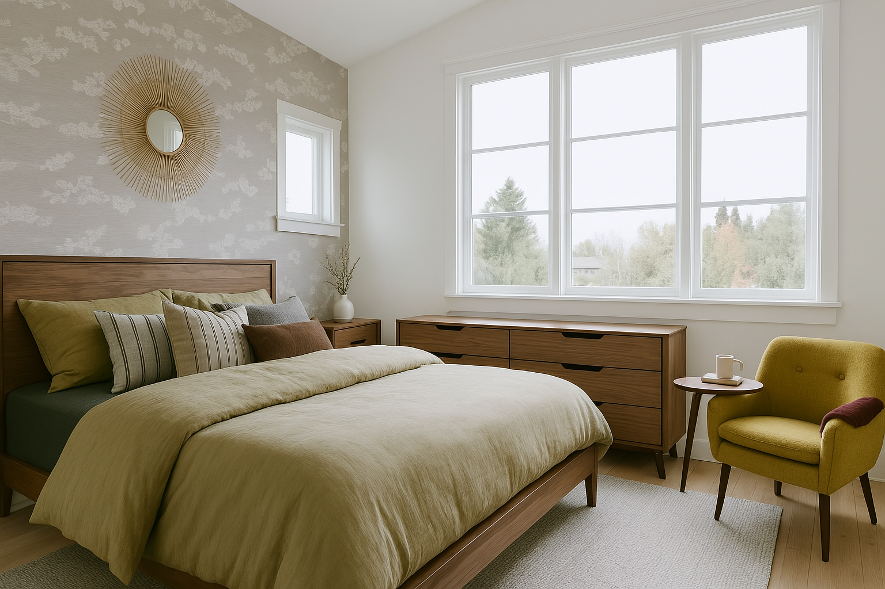

### Change Wall Color
Preview the room with a different wall color

**Tool/Model used:** `ChatGPT 4o` 

**Prompt:**
```
Create image Change the wall color of the room in the first attached image to the color of the second attached image, keeping all furniture, decorations, lighting, and layout exactly the same. Preserve shadows, textures, and natural lighting to maintain a realistic appearance.
```

 


---

### Preivew Furniture Layout
Preview the furniture layout in the room

**Tool/Model used:** `ChatGPT 4o` 

**Prompt:**
```
Create image  Realistically add the furniture from the second image into the room from the first image. Position it naturally behind the bed within the existing layout, matching the scale, perspective, lighting, and shadows of the original room. Preserve the original style and colors of the room while seamlessly integrating the new furniture, creating a cohesive and believable preview.
```
  

 

--- 


